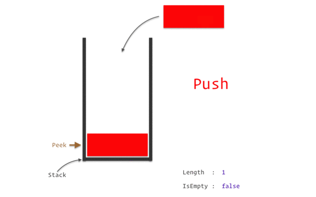

## Stack and Queue

To understand how stack and queue works look at the following diagrams.

Stack


Queue


1. Create a class name `Stack` with the following data and methods. Also implement a `length` getter method.

Data:

- `stack`

```js

class Stack{
    constructor(){
        this.stack =[];

    }

    push(elm){
        this.stack.push(elm);

        return this.stack
        
    }
    pop(elm){
        return this.stack.pop();
    }

    peek(index = this.stack.length - 1){
        return this.stack[index];
    }
    reverse(){
        return this.stack.reverse();
    }
    isEmpty(){
        return !(this.stack.length > 0);
    }
    displayStack(){
        return this.stack.join(" ");
    }

    get length(){
        return this.stack.length;
    }

}
```

Methods:

- `push`: will accept a value and add to the stack. Stack adds data at the end
- `pop`: will delete the last element (max index) of the stack
- `peek`: can accept and optional parameter. Will display the element at the given index(passed as argument). If nothing is passed display the last element (last index)
- `reverse`: will reverse all the elements of the stack and return the reversed stack
- `isEmpty`: returns `true` if the stack is empty and `false` if the stack has any data.
- `displayStack`: returns all the data in stack in string format

Getter

- `length`: returns the current length of the stack.

#### Test

```js
let myStack = new Stack();
myStack.push('One');
myStack.push('Two');
console.log(myStack.length); // 2
console.log(myStack.peek()); // "Two"
console.log(myStack.peek(0)); // "One"
console.log(myStack.reverse()); // ['Two', 'One']
console.log(myStack.displayStack()); // 'Two One'
myStack.pop();
console.log(myStack.length); // 1
console.log(myStack.peek()); // 'Two'
console.log(myStack.isEmpty()); // false
myStack.pop();
console.log(myStack.isEmpty()); // true
```

2. Create a class name `Queue` with the following data and methods. Also implement a `length` getter method.

Data:

- `queue`


```js
class Queue{
    constructor(){
        this.queue =[];

    }

    enqueue(elm){
        this.queue.push(elm);

        return this.queue
        
    }
    dequeue(elm){
        return this.queue.splice(0,1);
    }

    peek(index = 0){
        return this.queue[index];
    }

    isEmpty(){
        return !(this.queue.length > 0);
    }
    displayStack(){
        return this.queue.join(" ");
    }

    get length(){
        return this.queue.length;
    }

}
```
Methods:

- `enqueue`(item): Adds the item at the end of the queue
- `dequeue`: Removes an item from the top of the queue
- `peek`: can accept and optional parameter. Will display the element at the given index(passed as argument). If nothing is passed display the first element from top (index 0)
- `isEmpty`: returns `true` if the stack is empty and `false` if the stack has any data.
- `displayQueue`: returns all the data in stack in string format

Getter

- `length`: returns the current length of the stack.

#### Test

```js
let atmQueue = new Queue();
atmQueue.enqueue('Aman');
atmQueue.enqueue('John');
atmQueue.enqueue('Rohan');
console.log(atmQueue.displayQueue()); // "Aman John Rohan"
console.log(atmQueue.length); // 3
console.log(atmQueue.peek()); // "Aman"
console.log(atmQueue.peek(1)); // "John"
atmQueue.dequeue();
console.log(atmQueue.length); // 2
console.log(atmQueue.peek()); // 'John'
console.log(atmQueue.isEmpty()); // false
atmQueue.dequeue();
atmQueue.dequeue();
console.log(atmQueue.isEmpty()); // true
```
